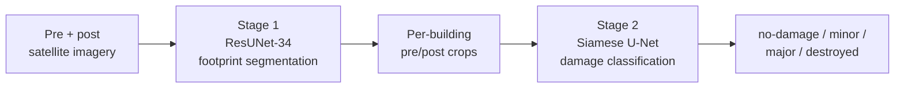

# AI-Enhanced Building Damage Assessment from Satellite Imagery — Russia–Ukraine Conflict
 
A two-stage deep-learning pipeline that detects building footprints in satellite imagery and grades each building's damage on the xView2/xBD four-level scale (no-damage / minor / major / destroyed). Built as an MSc Data Analytics dissertation at the University of Portsmouth (graded **80%**), supervised by Dr. Alice Good.
 
The pipeline pretrains on the large natural-disaster benchmark **xBD** and fine-tunes on conflict-specific imagery from three Ukrainian cities, testing how well disaster-trained models transfer to active-conflict damage.
 
<!-- TODO: confirm final code license (MIT assumed below). See LICENSE. -->
 
---
 
## Pipeline at a glance
 

 
- **Stage 1 — Segmentation:** ResUNet with a ResNet-34 encoder (ImageNet-initialised), trained with a weighted BCE + soft-Dice composite loss and a validation-swept decision threshold.
- **Stage 2 — Classification:** Siamese U-Net with a ResNet-50 backbone (shared weights), late-fusion head, trained with Focal Loss, effective-number class weighting, and a tempered sampler. An Early-Fusion network is kept as a baseline.
- **Transfer learning:** pretrain on xBD → fine-tune on `damage_assessment_ukraine` using a two-stage unfreezing schedule (head warm-up, then encoder unfreeze with a small encoder-to-head learning-rate ratio).
---
 
## Repository structure
 
```
satellite-building-damage-assessment-ukraine/
├── damage-assessment/      # Original dissertation code AS SUBMITTED + report PDF (archive, unchanged)
├── improved-assessment/    # Cleaned, streamlined reimplementation with modular .py files
├── README.md               # You are here (front door)
├── LICENSE
└── .gitignore
```
 
**Where to start**
 
- Description of the project and results → read on below.
- Organized code, methodology, and run/reproduce instructions → **[`improved-assessment/`](improved-assessment/)**.
- Original submission as graded (with the full report PDF) → **[`damage-assessment/`](damage-assessment/)**.
---
 
## Results
 
Reported as achieved, with the dissertation's aspirational targets shown for context. The targets were not reached; that is stated plainly here and discussed at length in the report.
 
### Segmentation (ResUNet-34)
 
| Stage | Split | IoU | Dice |
|---|---|---|---|
| xBD pretraining | validation | 0.568 | 0.724 |
| Ukraine fine-tune | held-out test (fold 0) | **0.593** | **0.744** |
 
Target: ≥ 0.65 mean IoU (not reached). Fine-tuning improved precision and produced a more balanced error profile in the conflict domain.
 
### Damage classification (Siamese U-Net, macro-F1 is the primary metric)
 
| Stage | Split | Accuracy | Macro-F1 |
|---|---|---|---|
| xBD pretraining | held-out test | 0.802 | **0.664** |
| Ukraine fine-tune | held-out test (+ TTA + bias) | 0.578 | **0.563** |
 
Target: ≥ 0.70 macro-F1 (not reached). On xBD, the Siamese design beat the Early-Fusion baseline (macro-F1 0.562 → 0.664). The strongest class throughout is **destroyed** (test F1 ≈ 0.73) — the most operationally critical category for humanitarian triage.
 
Full per-class precision/recall, confusion matrices, and training curves are in [`improved-assessment/`](improved-assessment/) and the report.
 
---
 
## Honest limitations
 
These are reported deliberately — the value of the work is in being clear about where it breaks, not in inflating numbers.
 
- **Minor vs. major boundary is the dominant error mode.** These adjacent, ordinal classes are subjective even for human annotators, and the model leaks between them; "major" behaves as a transitional bucket.
- **Performance degrades on raw, unprocessed vendor imagery.** Results are solid on the curated `damage_assessment_ukraine` data but drop on previously unseen Google Earth pre/post scenes: the segmenter misses large damaged complexes and thins dense residential blocks, and the classifier becomes unstable. Likely drivers are domain shift in radiometry/processing, scale and context mismatch from crop-based training, and conflict-specific damage morphology under-represented in xBD.
- **Conclusion:** the pipeline is decision-support, not an autonomous assessor. It is reliable within its dataset family and useful for triage of catastrophic loss, but needs explicit domain adaptation (and ideally SAR fusion, multi-scale features, tighter co-registration) before deployment in the wild.
---
 
## Data
 
| Dataset | Role | Scale | Licensing |
|---|---|---|---|
| **xBD** (xView2) | Pretraining | ~850,000 annotated buildings, ~45,000 km², 19 disaster events | CC BY-NC-SA 4.0 — attribution, non-commercial, share-alike |
| **`damage_assessment_ukraine`** (KOlegaBB, Hugging Face) | Fine-tuning + evaluation | 3 cities — Kamianka (Kharkiv), Yakovlivka (Donetsk), Popasna (Luhansk); 169 segmentation tiles, 2,219 classification building instances | Public research access; underlying imagery is from Google Maps/Earth and subject to Google's terms — **not redistributable** |
 
<!-- TODO: add the verified Hugging Face URL for KOlegaBB/damage_assessment_ukraine once confirmed. -->
 
This repository does **not** contain the datasets, the ~107,000 generated pre/post classification crops, the checkpoints, or the manifests — these are large and live in Google Drive (and the source imagery is not ours to redistribute). The code expects them to be mounted; see [`improved-assessment/`](improved-assessment/) for paths and setup.
 
- **xBD / xView2:** [xview2.org](https://xview2.org) · Gupta et al., 2019, [arXiv:1911.09296](https://arxiv.org/abs/1911.09296)
---
 
## Environment
 
Python 3.12.11 · PyTorch 2.8.0 (CUDA 12.6) · torchvision 0.23.0 · Albumentations 2.0.8 · OpenCV 4.12.0 · NumPy 2.0.2 · pandas 2.2.2. Developed and trained on Google Colab (GPU), with data and outputs persisted to Google Drive. Full setup and run instructions live in [`improved-assessment/`](improved-assessment/).
 
---
 
## Ethics
 
The work follows a deliberately conservative, harm-minimising posture, consistent with guidance on AI in armed conflict. Coordinate metadata, scene identifiers, and city-image mappings are withheld; figures are cropped and anonymised to explain model behaviour without enabling re-identification. Outputs are framed as analyst-supporting decision support with uncertainty, never autonomous targeting, with a human in the loop for high-stakes sites. Ethics approval: University of Portsmouth ref. TETHIC-2025-111203.
 
---
 
## Citation
 
> Bovolenta, A. (2025). *AI-Enhanced Damage Assessment from Satellite Imagery in the Russia–Ukraine Conflict* [MSc dissertation, University of Portsmouth].
 
---
 
## License
 
The code in this repository is released under the MIT License (see [`LICENSE`](LICENSE)). This covers the original code only — it does **not** relicense the xBD data (CC BY-NC-SA 4.0), the `damage_assessment_ukraine` data or its underlying Google imagery, or any pretrained weights, all of which remain under their own terms.
 
---
 
## Acknowledgements
 
University of Portsmouth, School of Computing — supervised by Dr. Alice Good. xBD/xView2 (Gupta et al., 2019) for the pretraining benchmark and damage taxonomy; KOlegaBB for the `damage_assessment_ukraine` dataset.
